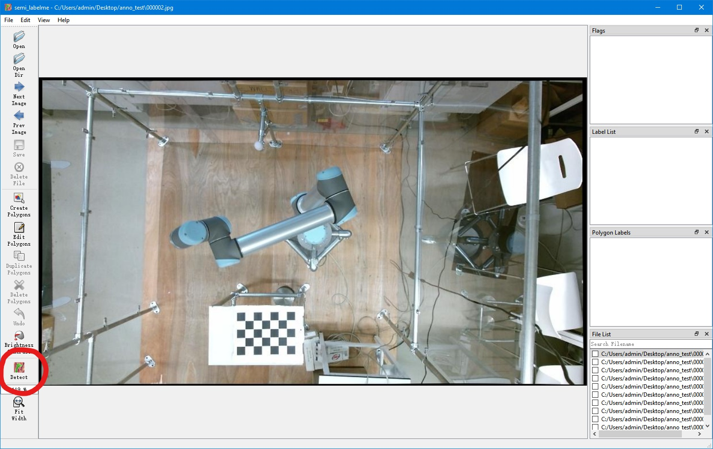
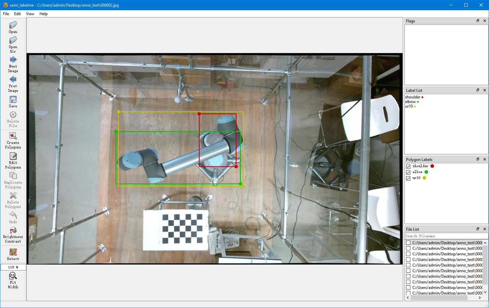

# Semi-automated Labelme
[](https://zenodo.org/badge/latestdoi/449187663)
## Description
[Labelme](https://github.com/wkentaro/labelme) is an image annotation tool for machine learning and deep learning inspired by [1, 2]. This tool has great impact in the development of object detection and segmentation with deep learning. Thanks to [Wada's contribution](https://github.com/wkentaro/labelme) [3], Labelme is developed and many researchers enjoy great benefits from it. 

This repo is an extension of Wada's work [3], we extend Labelme with Deep learning, consequently, we can speed up annotating images with the assistance of deep learning. In this repo, we use mmdetection [4], a famous detection toolbox, to achieve semi-automated annotating images so that users can use detector to get annotations without manually annotating.

## Installation
- Python environment and we recommand Python 3.7.
  ```
   conda create -n semi_labelme python=3.7 -y
   conda activate semi_labelme
  ```
- Install Pytorch and torchvision. Following the [official instructions](https://pytorch.org/), e.g.,
  ```shell
  conda install pytorch torchvision -c pytorch
  ```
- Install [mmcv and mmdetection](https://github.com/open-mmlab/mmdetection/blob/master/docs/en/get_started.md) and we would recommend you install it with [MIM](https://github.com/open-mmlab/mim).
  ```
  pip install openmim
  mim install mmdet
  ```

- Install semi_labelme
  ```
  # Under this repo
  pip install -e .
  ```

- Launch semi_labelme in the terminal
  ```
  semi_labelme
  ```
  Once the GUI of semi_labelme is launched, you have successfully installed this tool!
## Tutorials

It is easy to use semi_labelme which is the same as Labelme (please see [Labelme tutorials](https://github.com/wkentaro/labelme/tree/main/examples/tutorial#tutorial-single-image-example)). But in semi_labelme, you can just click 'Detect' button, then, the annotations are finished! Before you use detection function, you need to setup the config file which is in semi_labelme/config/default_config.yaml and prepare your deep learning pretrained model and its corresponding config file in ./work_dirs.

- Config Settings
  1. You need to prepare a config_file to decide which detector you are going to use and its corresponding pre-trained model. please see [model zoo in mmdetection](https://github.com/open-mmlab/mmdetection/blob/master/docs/en/model_zoo.md).
  2. Modify the config file in semi_labelme/config/default_config.yaml.

- Here we prepare an example for detecting manipulator UR10 which in ./work_dirs.

- Detect and annotate. Take these two picture for example, you just need to click the Detect button.  
  
  
  
  You can see the UR10 are annotated.

- Annotate all the images
   1. you can also use batch_annotation.py to annotate all the images and use the tool to check to the annotation later.

- For more tutorials, please see [Labelme tutorials](https://github.com/wkentaro/labelme/tree/main/examples/tutorial#tutorial-single-image-example).


## Citation

If you use this tool in your research, plsea cite this repo.

```
@software{wang_semi_labelme,
author = {Wang, Shenglin and Zhang, Jingqiong and Wang, Peng and Mihaylova, Lyudmila},
doi = {10.5281/zenodo.6393953},
license = {GPL-3},
title = {Semi-Automated Labelme, A Deep Learning Based Annotation Tool},
url = {https://github.com/wongsinglam/semi_labelme}
}
```

## Acknowledgements

[1] http://labelme.csail.mit.edu

[2] https://github.com/mpitid/pylabelme

[3] Wada, K. Labelme: Image Polygonal Annotation with Python [Computer software]. https://doi.org/10.5281/zenodo.5711226

[4] MMDetection Contributors. (2018). OpenMMLab Detection Toolbox and Benchmark [Computer software]. https://github.com/open-mmlab/mmdetection
